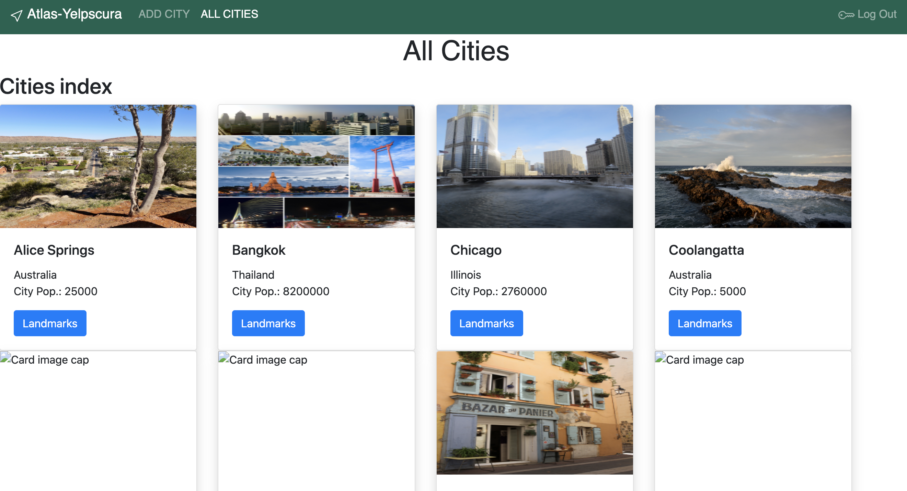

# Atlas Yelpscura application by Jack Lambert, August 2020

[Link](https://atlas-yelpscura2.herokuapp.com/) to project via heroku.

The idea from this app was conceived from the website known as [www.atlasobscura.com](https://www.atlasobscura.com/) which lets people find intriguing places of interest that a naive tourist may not know about.

Using the tabs in the nav bar you can enter a city or town, its information, and then enter in individual landmarks within that city or town, as well as add images, and a user paragraph about.

This app also requires Google OAuth to login.

## Tools used:

- Javascript/HTML/CSS
- Built with Node JS
  - dependencies: MongoDB, ejs, Morgan, Passport, Express and others

The app essentially is its own api using Google Developers condole and MongoDB. its Identification variables are stored in the Environmental variable file.

app.js is the main file running the app through node.
Two Models are used with Three total Schemas: Traveler - the User, City - the main Schema, and Landmark - Embedded within City.

All four methods of CRUD RESTful routing are used.

## CRUD

- C - Create. users can Create a city and Landmark
- R - Read. users can get posts of cities and landmarks.
- U - Update. users can update Landmark information through 'Edit'.
- D - Delete. users can delete landmarks with button.

### Styling

Mainly Bootstrap is used with some custom colors and fonts.
the top user interface is the bootstrap Cards, of which is displayed with cities and landmarks.

### Images

#### Planning

Trello Board

#### Screen shots

Homepage

Cities Index

Landmarks

Add Landmark Form

### Suggestions

This most challenging part of this project was creating the controller actions, as it seems counter-intuitive and debugging is also challenge as not much information is always given. Getting the application to work took much instructor guidance and time away from styling. Many different add-ons to schemas would be benificial and to follow my original idea of a user being able to add reviews to indivudal landmarks, however embedding a schema within a schema is too advanced for my skills at the moment and I plan on coming back to this in the future.
